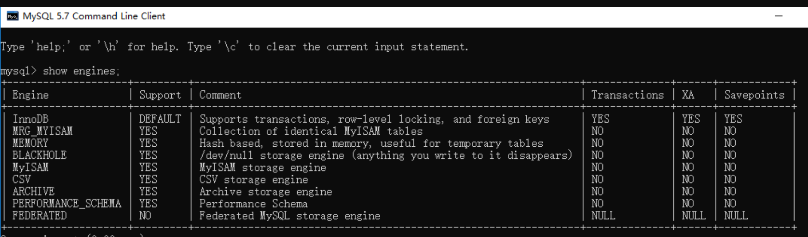
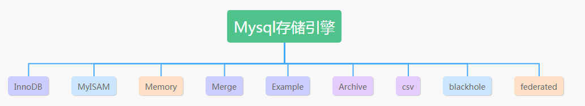
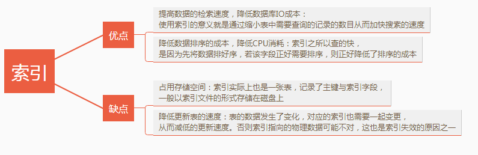
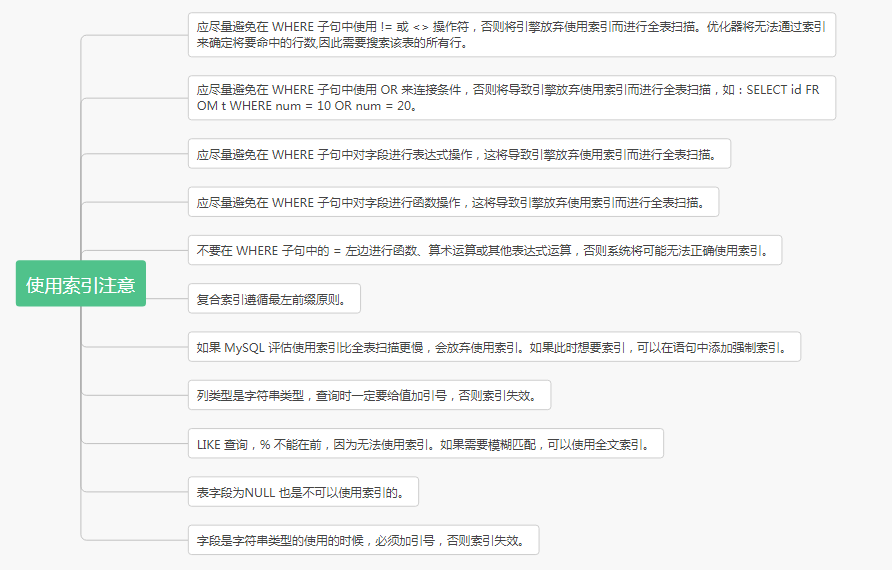

1、数据库的三范式是什么
- 第一范式：列不可再分
- 第二范式：行可以唯一区分，主键约束
- 第三范式：表的非主属性不能依赖与其他表的非主属性 外键约束 且三大范式是一级一级依赖的，第二范式建立在第一范式上，第三范式建立第一第二范式上。

2、MySQL数据库引擎有哪些
1. 查看mysql提供的所有存储引擎

```mysql
mysql> show engines;
```





2. mysql常用引擎
- **MYISAM**：全表锁，拥有较高的执行速度，不支持事务，不支持外键，并发性能差，占用空间相对较小，对事务完整性没有要求，以select、insert为主的应用基本上可以使用这引擎
- **Innodb**:行级锁，提供了具有提交、回滚和崩溃回复能力的事务安全，支持自动增长列，支持外键约束，并发能力强，占用空间是MYISAM的2.5倍，处理效率相对会差一些
- **Memory**:全表锁，存储在内容中，速度快，但会占用和数据量成正比的内存空间且数据在mysql重启时会丢失，默认使用HASH索引，检索效率非常高，但不适用于精确查找，主要用于那些内容变化不频繁的代码表
- **MERGE**：是一组MYISAM表的组合

### 3、说说InnoDB与MyISAM的区别

1. InnoDB支持事务，MyISAM不支持，对于InnoDB每一条SQL语言都默认封装成事务，自动提交，这样会影响速度，所以最好把多条SQL语言放在begin和commit之间，组成一个事务；
2. InnoDB支持外键，而MyISAM不支持。对一个包含外键的InnoDB表转为MYISAM会失败；
3. InnoDB是聚集索引，数据文件是和索引绑在一起的，必须要有主键，通过主键索引效率很高。但是辅助索引需要两次查询，先查询到主键，然后再通过主键查询到数据。因此，主键不应该过大，因为主键太大，其他索引也都会很大。而MyISAM是非聚集索引，数据文件是分离的，索引保存的是数据文件的指针。主键索引和辅助索引是独立的。
4. InnoDB不保存表的具体行数，执行select count(*) from table时需要全表扫描。而MyISAM用一个变量保存了整个表的行数，执行上述语句时只需要读出该变量即可，速度很快；
5. Innodb不支持全文索引，而MyISAM支持全文索引，查询效率上MyISAM要高；

### 4、数据库的事务

#### 什么是事务？
多条sql语句，要么全部成功，要么全部失败。

#### 事务的特性：

数据库事务特性：原子性(Atomic)、一致性(Consistency)、隔离性(Isolation)、持久性(Durabiliy)。简称ACID。
**原子性**：组成一个事务的多个数据库操作是一个不可分割的原子单元，只有所有操作都成功，
整个事务才会提交。任何一个操作失败，已经执行的任何操作都必须撤销，让数据库返回初始状态。
一致性：事务操作成功后，数据库所处的状态和它的业务规则是一致的。即数据不会被破坏。如A转账100元给B，不管操作是否成功，A和B的账户总额是不变的。
**隔离性**：在并发数据操作时，不同的事务拥有各自的数据空间，它们的操作不会对彼此产生干扰
**持久性**：一旦事务提交成功，事务中的所有操作都必须持久化到数据库中。

### 5、索引是什么

官方介绍索引是帮助MySQL高效获取数据的数据结构。更通俗的说，数据库索引好比是一本书前面的目录，能加快数据库的查询速度。一般来说索引本身也很大，不可能全部存储在内存中，因此索引往往是存储在磁盘上的文件中的（可能存储在单独的索引文件中，也可能和数据一起存储在数据文件中）。我们通常所说的索引，包括聚集索引、覆盖索引、组合索引、前缀索引、唯一索引等，没有特别说明，默认都是使用B+树结构组织（多路搜索树，并不一定是二叉的）的索引。

### 6、SQL优化手段有哪些

1. 查询语句中不要使用select *
2. 尽量减少子查询，使用关联查询（left join,right join,inner join）替代
3. 减少使用IN或者NOT IN ,使用exists，not exists或者关联查询语句替代
4. or 的查询尽量用 union或者union all 代替(在确认没有重复数据或者不用剔除重复数据时，union all会更好)
5. 应尽量避免在 where 子句中使用!=或<>操作符，否则将引擎放弃使用索引而进行全表扫描。
6. 应尽量避免在 where 子句中对字段进行 null 值判断，否则将导致引擎放弃使用索引而进行全表扫描，如： select id from t where num is null 可以在num上设置默认值0，确保表中num列没有null值，然后这样查询： select id from t where num=0

### 7、简单说一说drop、delete与truncate的区别

SQL中的drop、delete、truncate都表示删除，但是三者有一些差别delete和truncate只删除表的数据不删除表的结构 速度,一般来说: drop> truncate >delete delete
语句是dml,这个操作会放到rollback segement中,事务提交之后才生效; 如果有相应的trigger,执行的时候将被触发. truncate,drop是ddl, 操作立即生效,原数据不放到rollback segment中,不能回滚.操作不触发trigger.

### 8、什么是视图

视图是一种虚拟的表，具有和物理表相同的功能。可以对视图进行增，改，查，操作，试图通常是有一个表或者多个表的行或列的子集。对视图的修改不影响基本表。它使得我们获取数据更容易，相比多表查询。

9、 什么是内联接、左外联接、右外联接？
**内联接**（Inner Join）：匹配2张表中相关联的记录。
**左外联接**（Left Outer Join）：除了匹配2张表中相关联的记录外，还会匹配左表中剩余的记录，右表中未匹配到的字段用NULL表示。
**右外联接**（Right Outer Join）：除了匹配2张表中相关联的记录外，还会匹配右表中剩余的记录，左表中未匹配到的字段用NULL表示。在判定左表和右表时，要根据表名出现在Outer Join的左右位置关系。

### 10、并发事务带来哪些问题?

在典型的应用程序中，多个事务并发运行，经常会操作相同的数据来完成各自的任务（多个用户对同一数据进行操作）。并发虽然是必须的，但可能会导致以下的问题。

1. **脏读**（Dirty read）: 当一个事务正在访问数据并且对数据进行了修改，而这种修改还没有提交到数据库中，这时另外一个事务也访问了这个数据，然后使用了这个数据。因为这个数据是还没有提交的数据，那么另外一个事务读到的这个数据是“脏数据”，依据“脏数据”所做的操作可能是不正确的。

2. **丢失修改**（Lost to modify）: 指在一个事务读取一个数据时，另外一个事务也访问了该数据，那么在第一个事务中修改了这个数据后，第二个事务也修改了这个数据。这样第一个事务内的修改结果就被丢失，因此称为丢失修改。 例如：事务1读取某表中的数据A=20，事务2也读取A=20，事务1修改A=A-1，事务2也修改A=A-1，最终结果A=19，事务1的修改被丢失。

3. **不可重复读**（Unrepeatableread）: 指在一个事务内多次读同一数据。在这个事务还没有结束时，另一个事务也访问该数据。那么，在第一个事务中的两次读数据之间，由于第二个事务的修改导致第一个事务两次读取的数据可能不太一样。这就发生了在一个事务内两次读到的数据是不一样的情况，因此称为不可重复读。
   
4. **幻读**（Phantom read）: 幻读与不可重复读类似。它发生在一个事务（T1）读取了几行数据，接着另一个并发事务（T2）插入了一些数据时。在随后的查询中，第一个事务（T1）就会发现多了一些原本不存在的记录，就好像发生了幻觉一样，所以称为幻读。

**不可重复读和幻读区别**：

1.  不可重复读的重点是修改比如多次读取一条记录发现其中某些列的值被修改

2.  幻读的重点在于新增或者删除比如多次读取一条记录发现记录增多或减少了。


### 11，事务隔离级别有哪些?MySQL的默认隔离级别是?

SQL 标准定义了四个隔离级别：
READ-UNCOMMITTED(**读取未提交**)： 最低的隔离级别，允许读取尚未提交的数据变更，可能会导致脏读、幻读或不可重复读。
READ-COMMITTED(**读取已提交**)： 允许读取并发事务已经提交的数据，可以阻止脏读，但是幻读或不可重复读仍有可能发生。
REPEATABLE-READ(**可重复读**)： 对同一字段的多次读取结果都是一致的，除非数据是被本身事务自己所修改，可以阻止脏读和不可重复读，但幻读仍有可能发生。
SERIALIZABLE(**可串行化**)： 最高的隔离级别，完全服从ACID的隔离级别。所有的事务依次逐个执行，这样事务之间就完全不可能产生干扰，也就是说，该级别可以防止脏读、不可重复读
以及幻读。

| **隔离级别**         | **脏读** | **不可重复读** | **幻影读** |
| ---------------- | ------ | --------- | ------- |
| READ-UNCOMMITTED | √      | √         | √       |
| READ-COMMITTED   | ×      | √         | √       |
| REPEATABLE-READ  | ×      | ×         | √       |
| SERIALIZABLE     | ×      | ×         | ×       |

MySQL InnoDB 存储引擎的默认支持的隔离级别是 **REPEATABLE-READ（可重读）**。我们可以通过

`SELECT @@tx_isolation;`命令来查看

```mysql
mysql> SELECT @@tx_isolation;
+-----------------+
| @@tx_isolation |
+-----------------+
| REPEATABLE-READ |
+-----------------+
```

**这里需要注意的是**：与 SQL 标准不同的地方在于 InnoDB 存储引擎在 REPEATABLE-READ（可重读） 事务隔离级别下使用的是Next-Key Lock 锁算法，因此可以避免幻读的产生，这与其他数据库系统(如 SQL Server) 是不同的。所以说InnoDB 存储引擎的默认支持的隔离级别是 REPEATABLEREAD（可重读） 已经可以完全保证事务的隔离性要求，即达到了 SQL标准的 SERIALIZABLE(可串行化) 隔离级别。因为隔离级别越低，事务请求的锁越少，所以大部分数据库系统的隔离级别都是READ-COMMITTED(读取提交内容) ，但是你要知道的是InnoDB 存储引擎默认使用REPEAaTABLE-READ（可重读） 并不会有任何性能损失。InnoDB 存储引擎在 分布式事务 的情况下一般会用到 SERIALIZABLE(可串行化) 隔离级别。

### 12，大表如何优化？

当MySQL单表记录数过大时，数据库的CRUD性能会明显下降，一些常见的优化措施如下：

1. **限定数据的范围**
   务必禁止不带任何限制数据范围条件的查询语句。比如：我们当用户在查询订单历史的时候，我们可以控制在一个月的范围内；

2. **读/写分离**
   经典的数据库拆分方案，主库负责写，从库负责读；

3. **垂直分区**
   **根据数据库里面数据表的相关性进行拆分**。 例如，用户表中既有用户的登录信息又有用户的基本信息，可以将用户表拆分成两个单独的表，甚至放到单独的库做分库。

   **简单来说垂直拆分是指数据表列的拆分，把一张列比较多的表拆分为多张表**。 如下图所示，这样来说大家应该就更容易理解了。

   -   垂直拆分的优点： 可以使得列数据变小，在查询时减少读取的Block数，减少I/O次数。此外，垂直分区可以简化表的结构，易于维护。

   -   垂直拆分的缺点： 主键会出现冗余，需要管理冗余列，并会引起Join操作，可以通过在应用层进行Join来解决。此外，垂直分区会让事务变得更加复杂；

4. **水平分区**
   **保持数据表结构不变，通过某种策略存储数据分片。这样每一片数据分散到不同的表或者库中，达到了分布式的目的。 水平拆分可以支撑非常大的数据量。**
   水平拆分是指数据表行的拆分，表的行数超过200万行时，就会变慢，这时可以把一张的表的数据拆成多张表来存放。举个例子：我们可以将用户信息表拆分成多个用户信息表，这样就可以避免单一表数据量过大对性能造成影响。

   水平拆分可以支持非常大的数据量。需要注意的一点是：分表仅仅是解决了单一表数据过大的问题，但由于表的数据还是在同一台机器上，其实对于提升MySQL并发能力没有什么意义，所以 水平拆分最好分库 。

   水平拆分能够 **支持非常大的数据量存储，应用端改造也少**，但 **分片事务难以解决** ，跨节点Join性能较差，逻辑复杂。《Java工程师修炼之道》的作者推荐 **尽量不要对数据进行分片，因为拆分会带来逻辑、部署、运维的各种复杂度** ，一般的数据表在优化得当的情况下支撑千万以下的数据量是没有太大问题的。如果实在要分片，尽量选择客户端分片架构，这样可以减少一次和中间件的网络I/O。

   #### 下面补充一下数据库分片的两种常见方案：

   **客户端代理**： 分片逻辑在应用端，封装在jar包中，通过修改或者封装JDBC层来实现。 当当网的 Sharding-JDBC 、阿里的TDDL是两种比较常用的实现。
   **中间件代理**： 在应用和数据中间加了一个代理层。分片逻辑统一维护在中间件服务中。 我们现在谈的 Mycat 、360的Atlas、网易的DDB等等都是这种架构的实现。
   详细内容可以参考： MySQL大表优化方案: https://segmentfault.com/a/1190000006158186

   ### 13、分库分表之后,id 主键如何处理？

   因为要是分成多个表之后，每个表都是从 1 开始累加，这样是不对的，我们需要一个全局唯一的 id来支持。生成全局 id 有下面这几种方式：
   **UUID**：不适合作为主键，因为太长了，并且无序不可读，查询效率低。比较适合用于生成唯一的名字的标示比如文件的名字。
   **数据库自增 id** : 两台数据库分别设置不同步长，生成不重复ID的策略来实现高可用。这种方式
   生成的 id 有序，但是需要独立部署数据库实例，成本高，还会有性能瓶颈。利用 redis 生成 id : 性能比较好，灵活方便，不依赖于数据库。但是，引入了新的组件造成系
   统更加复杂，可用性降低，编码更加复杂，增加了系统成本。
   **Twitter的snowflake算法** ：Github 地址：https://github.com/twitter-archive/snowflake。

   **美团的Leaf分布式ID生成系统** ：Leaf 是美团开源的分布式ID生成器，能保证全局唯一性、趋势递增、单调递增、信息安全，里面也提到了几种分布式方案的对比，但也需要依赖关系数据库、Zookeeper等中间件。感觉还不错。美团技术团队的一篇文章：https://tech.meituan.com/2017/04/21/mt-leaf.html 。

   ### 14、 说说在 MySQL 中一条查询 SQL 是如何执行的？

   比如下面这条SQL语句：

   ```mysql
   select name from t_user where id=1
   ```

   1. 取得链接，使用使用到 MySQL 中的连接器。
   2. 查询缓存，key 为 SQL 语句，value 为查询结果，如果查到就直接返回。不建议使用次缓存，在 MySQL 8.0 版本已经将查询缓存删除，也就是说 MySQL 8.0 版本后不存在此功能。
   3. 分析器，分为词法分析和语法分析。此阶段只是做一些 SQL 解析，语法校验。所以一般语法错误在此阶段。
   4. 优化器，是在表里有多个索引的时候，决定使用哪个索引；或者一个语句中存在多表关联的时候（join），决定各个表的连接顺序。
   5. 执行器，通过分析器让 SQL 知道你要干啥，通过优化器知道该怎么做，于是开始执行语句。执行语句的时候还要判断是否具备此权限，没有权限就直接返回提示没有权限的错误；有权限则打开表，根据表的引擎定义，去使用这个引擎提供的接口，获取这个表的第一行，判断 id 是都等于 1。如果是，直接返回；如果不是继续调用引擎接口去下一行，重复相同的判断，直到取到这个表的最后一行，最后返回。
      
### 15、索引有什么优缺点？




### 16、 MySQL 中 varchar 与 char 的区别？varchar(30) 中的 30代表的涵义？

varchar 与 char 的区别，char 是一种固定长度的类型，varchar 则是一种可变长度的类型。varchar(30) 中 30 的涵义最多存放 30 个字符。varchar(30) 和 (130) 存储 hello 所占空间一样，但后者在排序时会消耗更多内存，因为 ORDER BY col 采用 fixed_length 计算 col 长度（memory 引擎也一样）。对效率要求高用 char，对空间使用要求高用 varchar。

### 17、 int(11) 中的 11 代表什么涵义？

int(11) 中的 11，不影响字段存储的范围，只影响展示效果。

### 18、 为什么 SELECT COUNT(*) FROM table 在 InnoDB 比MyISAM 慢？*

对于 SELECT COUNT(*) FROM table 语句，在没有 WHERE 条件的情况下，InnoDB 比 MyISAM 可能会慢很多，尤其在大表的情况下。因为，InnoDB 是去实时统计结果，会全表扫描；而 MyISAM内部维持了一个计数器，预存了结果，所以直接返回即可。

### 19、说说 InnoDB 与 MyISAM 有什么区别？
- 在 MySQL 5.1 及之前的版本中，MyISAM 是默认的存储引擎，而在 MySQL 5.5 版本以后，默认使用 InnoDB 存储引擎。
- MyISAM 不支持行级锁，换句话说，MyISAM 会对整张表加锁，而不是针对行。同时，MyISAM 不支持事务和外键。MyISAM 可被压缩，存储空间较小，而且 MyISAM 在筛选大量数据时非常快。
- InnoDB 是事务型引擎，当事务异常提交时，会被回滚。同时，InnoDB 支持行锁。此外，InnoDB 需要更多存储空间，会在内存中建立其专用的缓冲池用于高速缓冲数据和索引。InnoDB 支持自动奔溃恢复特性。
  

**建议**：一般情况下，个人建议优先选择 InnoDB 存储引擎，并且尽量不要将 InnoDB 与 MyISAM 混合使用。

### 20、MySQL 索引类型有哪些？

- 主键索引
   索引列中的值必须是唯一的，不允许有空值。
- 普通索引
   MySQL中基本索引类型，没有什么限制，允许在定义索引的列中插入重复值和空值。
- 唯一索引
   索引列中的值必须是唯一的，但是允许为空值。
- 全文索引
   只能在文本类型CHAR,VARCHAR,TEXT类型字段上创建全文索引。字段长度比较大时，如果创建普通索引，在进行like模糊查询时效率比较低，这时可以创建全文索引。MyISAM和InnoDB中都可以使用全文索引。
- 空间索引
   MySQL在5.7之后的版本支持了空间索引，而且支持OpenGIS几何数据模型。MySQL在空间索引这方面遵循OpenGIS几何数据模型规则。
- 前缀索引
   在文本类型如CHAR,VARCHAR,TEXT类列上创建索引时，可以指定索引列的长度，但是数值类型不能指定。
- 其他（按照索引列数量分类）
   1. 单列索引
   2. 组合索引
      组合索引的使用，需要遵循最左前缀匹配原则（最左匹配原则）。一般情况下在条件允许的情
      况下使用组合索引替代多个单列索引使用。

21、什么时候不要使用索引？

- 经常增删改的列不要建立索引；

- 有大量重复的列不建立索引；

- 表记录太少不要建立索引。
  

### 22、说说什么是 MVCC？

   多版本并发控制（MVCC=Multi-Version Concurrency Control），是一种用来解决读 - 写冲突的无锁并发控制。也就是为事务分配单向增长的时间戳，为每个修改保存一个版本。版本与事务时间戳关联，读操作只读该事务开始前的数据库的快照（复制了一份数据）。这样在读操作不用阻塞写操作，写操作不用阻塞读操作的同时，避免了脏读和不可重复读。

### 23、MVCC 可以为数据库解决什么问题？

   在并发读写数据库时，可以做到在读操作时不用阻塞写操作，写操作也不用阻塞读操作，提高了数据库并发读写的性能。同时还可以解决脏读、幻读、不可重复读等事务隔离问题，但不能解决更新丢失问题。

### 24、说说 MVCC 的实现原理

   MVCC 的目的就是多版本并发控制，在数据库中的实现，就是为了解决读写冲突，它的实现原理主要是依赖记录中的 3 个隐式字段、undo 日志、Read View 来实现的。

### 25、MySQL 事务隔离级别？

   READ UNCOMMITTED（未提交读）：事务中的修改，即使没有提交，对其他事务也都是可见的。会导致脏读。
   READ COMMITTED（提交读）：事务从开始直到提交之前，所做的任何修改对其他事务都是不可见的。会导致不可重复读。这个隔离级别，也可以叫做“不可重复读”。
   REPEATABLE READ（可重复读）：一个事务按相同的查询条件读取以前检索过的数据，其他事务插入了满足其查询条件的新数据。产生幻行，会导致幻读。（MySQL 默认隔离级别）SERIALIZABLE（可串行化）：强制事务串行执行。

### 26、 请说说 MySQL 数据库的锁？

   关于 MySQL 的锁机制，可能会问很多问题，不过这也得看面试官在这方面的知识储备。MySQL 中有共享锁和排它锁，也就是读锁和写锁。

1. 共享锁：不堵塞，多个用户可以同一时刻读取同一个资源，相互之间没有影响。

2. 排它锁：一个写操作阻塞其他的读锁和写锁，这样可以只允许一个用户进行写入，防止其他用户读取正在写入的资源。

3. 表锁：系统开销最小，会锁定整张表，MyISAM 使用表锁。

4.  行锁：容易出现死锁，发生冲突概率低，并发高，InnoDB 支持行锁（必须有索引才能实现，否则会自动锁全表，那么就不是行锁了）。

### 27、说说什么是锁升级？

- MySQL 行锁只能加在索引上，如果操作不走索引，就会升级为表锁。因为 InnoDB 的行锁是加在索引上的，如果不走索引，自然就没法使用行锁了，原因是 InnoDB 是将 primary key index和相关的行数据共同放在 B+ 树的叶节点。InnoDB 一定会有一个 primary key，secondaryindex 查找的时候，也是通过找到对应的 primary，再找对应的数据行。
- 当非唯一索引上记录数超过一定数量时，行锁也会升级为表锁。测试发现当非唯一索引相同的内容不少于整个表记录的二分之一时会升级为表锁。因为当非唯一索引相同的内容达到整个记录的二分之一时，索引需要的性能比全文检索还要大，查询语句优化时会选择不走索引，造成索引失效，行锁自然就会升级为表锁。

### 28、说说悲观锁和乐观锁

####     悲观锁

- 说的是数据库被外界（包括本系统当前的其他事物以及来自外部系统的事务处理）修改保持着保守态度，因此在整个数据修改过程中，将数据处于锁状态。悲观的实现往往是依靠数据库提供的锁机制，也只有数据库层面提供的锁机制才能真正保证数据访问的排他性，否则，即使在本系统汇总实现了加锁机制，也是没有办法保证系统不会修改数据。
- 在悲观锁的情况下，为了保证事务的隔离性，就需要一致性锁定读。读取数据时给加锁，其它事务无法修改这些数据。修改删除数据时也要加锁，其它事务无法读取这些数据。

####     乐观锁

- 相对悲观锁而言，乐观锁机制采取了更加宽松的加锁机制。悲观锁大多数情况下依靠数据库的锁机制实现，以保证操作最大程度的独占性。但随之而来的就是数据库性能的大量开销，特别是对长事务而言，这样的开销往往无法承受。
- 而乐观锁机制在一定程度上解决了这个问题。乐观锁，大多是基于数据版本（Version）记录机制实现。何谓数据版本？即为数据增加一个版本标识，在基于数据库表的版本解决方案中，一般是通过为数据库表增加一个“version”字段来实现。读取出数据时，将此版本号一同读出，之后更新时，对此版本号加一。此时，将提交数据的版本数据与数据库表对应记录的当前版本信息进行比对，如果提交的数据版本号大于数据库表当前版本号，则予以更新，否则认为是过期数据。

###     29、怎样尽量避免死锁的出现？

1. 设置获取锁的超时时间，至少能保证最差情况下，可以退出程序，不至于一直等待导致死锁；
2. 设置按照同一顺序访问资源，类似于串行执行；
3. 避免事务中的用户交叉；
4. 保持事务简短并在一个批处理中；
5. 使用低隔离级别；
6. 使用绑定链接。

30、使用 MySQL 的索引应该注意些什么？
​    
​

### 31、CHAR 和 VARCHAR 的区别？

- CHAR 和VARCHAR 类型在存储和检索方面有所不同
- CHAR 列长度固定为创建表时声明的长度，长度值范围是1 到255当 CHAR 值被存储时，它们被用空格填充到特定长度，检索CHAR 值时需删除尾随空格。
​

### 32、主键和候选键有什么区别？

​    表格的每一行都由主键唯一标识,一个表只有一个主键。主键也是候选键。按照惯例，候选键可以被指定为主键，并且可以用于任何外 键引用。
​

### 33、主键与索引有什么区别？

-   ​    主键一定会创建一个唯一索引，但是有唯一索引的列不一定是主键；

-   ​    主键不允许为空值，唯一索引列允许空值；
-   ​    一个表只能有一个主键，但是可以有多个唯一索引；
-   ​    主键可以被其他表引用为外键，唯一索引列不可以；
-   ​    主键是一种约束，而唯一索引是一种索引，是表的冗余数据结构，两者有本

### 34、 MySQL 如何做到高可用方案？

​    MySQL 高可用，意味着不能一台 MySQL 出了问题，就不能访问了。
1.  MySQL 高可用：分库分表，通过 MyCat 连接多个 MySQL
2.  MyCat 也得高可用：Haproxy，连接多个 MyCat
3.  Haproxy 也得高可用：通过 keepalived 辅助 Haproxy
